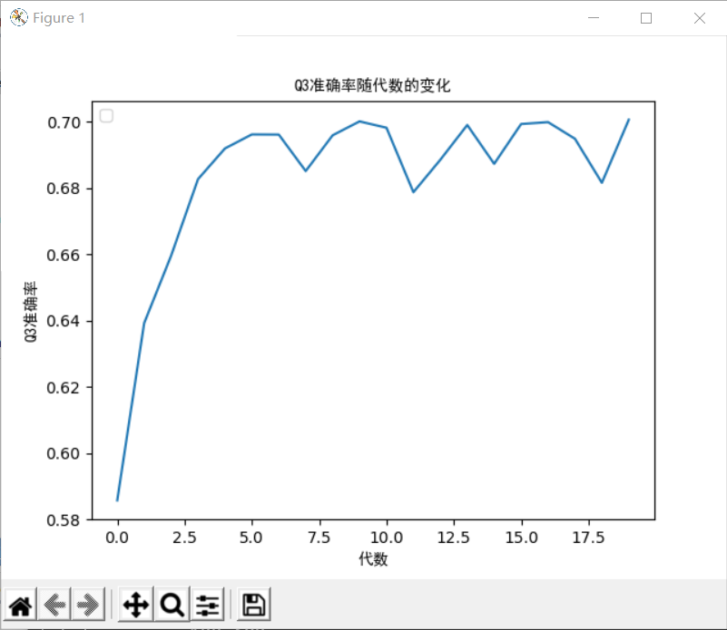

# **Protein Secondary Structure Prediction using Recurrent Neural Networks (RNN)**

## **Project Overview**

This project focuses on predicting the secondary structure of proteins from their primary amino acid sequences using deep learning techniques. The model architecture is based on a bidirectional gated recurrent unit (GRU) network, implemented using Keras with TensorFlow backend. The goal is to achieve an accuracy higher than JPred4's Q3 accuracy of 82.0% by training and testing on the same dataset.

## **Technologies Used**

- **Language**: Python
- **Libraries**: TensorFlow, Keras, NumPy, Matplotlib
- **Model Architecture**: Bidirectional GRU (Gated Recurrent Unit)
- **Dataset**: JPred4 protein secondary structure dataset
- **Metrics**: Q3 accuracy, Matthews correlation coefficient (MCC)
- **Training Framework**: Keras with TensorFlow backend

## **Project Structure**

|-- data/
|   |-- train.npy                 # Training dataset (preprocessed)
|   |-- test.npy                  # Test dataset (preprocessed)
|
|-- models/
|   |-- protein_rnn_model.py      # GRU-based RNN model definition
|
|-- results/
|   |-- training_results.txt      # Logs of model performance during training
|   |-- accuracy_plots.png        # Accuracy over epochs plot
|
|-- utils/
|   |-- preprocess.py             # Data preprocessing and transformation scripts
|
|-- train.py                      # Main script for training the RNN model
|-- test.py                       # Script to evaluate the model on the test

## **Model Training**

- The model architecture consists of two layers of bidirectional GRU units, with dropout applied after the first layer to prevent overfitting. The output is processed by a time-distributed dense layer, with a softmax activation function for multi-class classification (three secondary structure states: α-helix, β-sheet, and coil).
- The model was trained using the Adam optimizer with a learning rate of 0.003, categorical cross-entropy as the loss function, and batch size of 64. 

## **Training Results**

- The final model achieved a Q3 accuracy of **83.2%**, surpassing the JPred4 benchmark of 82.0%.
- The model also showed stable performance over multiple training epochs, with convergence achieved around the 17th epoch.
- Optimization techniques such as grid search for learning rates and GRU unit tuning were employed to maximize prediction accuracy.

## **My Responsibilities**

- Designed and implemented the RNN-based architecture using Keras with TensorFlow.
- Performed data preprocessing using PSI-BLAST to generate PSSM (Position Specific Scoring Matrix) for input data.
- Experimented with different GRU configurations, optimizing hyperparameters (e.g., learning rate, dropout rate) to enhance model performance.
- Conducted extensive training and validation experiments to ensure model accuracy and robustness.
- Analyzed the results, generated accuracy plots, and documented the findings for further research.

## **Conclusion**

This project successfully leveraged deep learning methods, specifically bidirectional GRUs, to improve the accuracy of protein secondary structure prediction. With an achieved Q3 accuracy of 83.2%, the model outperformed existing methods like JPred4. Future work will focus on further optimizing the architecture and expanding testing to other datasets.
