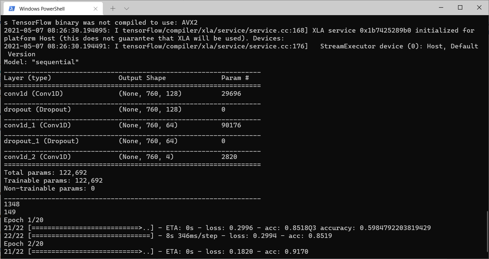
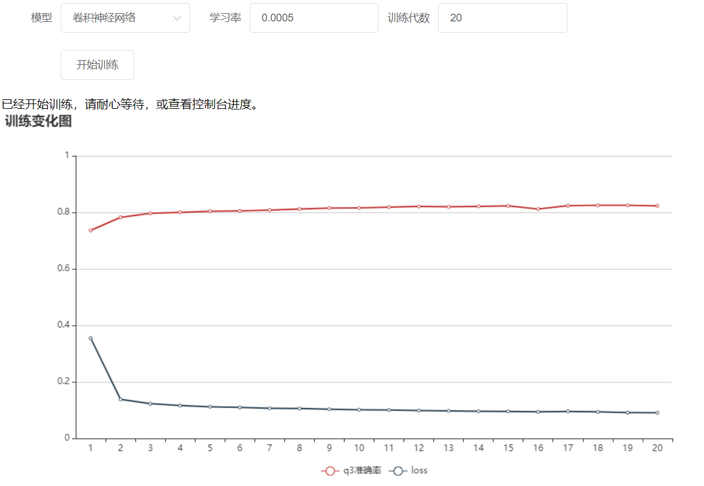

# graduation
毕业设计 蛋白质二级结构预测   
 
使用的训练及测试数据 test.npy,train.npy来自JPred4 
地址：http://www.compbio.dundee.ac.uk/jpred/about_RETR_JNetv231_details.shtml 
在这里直接给出，是为了方便使用，如有侵犯，会立刻删除。 
水平所限，目前只是做了很简单的搭建神经网络和训练过程，不涉及更深入的内容。


#[查看论文](循环神经网络预测蛋白质二级结构.md)
# 使用教程 
### window操作系统

```shell
git clone https://github.com/cedar997/graduation.git
cd graduation

# 使用清华pip镜像，下载更快
pip3 config set global.index-url https://pypi.tuna.tsinghua.edu.cn/simple  

# 安装运行所需的扩展包
pip install -r requirements.txt
```
### linux、unix操作系统
```shell
sudo apt install git  
git clone https://github.com/cedar997/graduation.git   
cd graduation
# 安装pip3，以便安装python包
sudo apt install python3-pip  
# 使用清华pip镜像，下载更快
pip3 config set global.index-url https://pypi.tuna.tsinghua.edu.cn/simple  
# 安装运行所需的扩展包
pip3 install -r requirements.txt
```

- notes: 如果你的机器有nvidia显卡，并支持cuda,则可以大大加快训练的速度 
具体安装步骤请参考 https://tensorflow.google.cn/install  
这里只给出cpu版本的环境搭建方法
# 开始探索！！！
## 第一步
>python3 main.py  


如果需要修改运行效果，请查看main.py
### 开始训练
默认使用cnn,能获得较快的训练速度。

### 训练结果


## 第二步
使用网页进行管理，可以选择多个模型
>python3 app.py

用浏览器打开 http://localhost:5000/ 效果如下图所示
 

## 文件说明
- train.npy为训练集，test.npy为测试集
- main.py为主程序，运行它，就能得到我预设的效果，修改它就可以得到更多的功能
- mytools.py 为我写的工具箱，方便程序编写
- saved_model.h5 保存训练后的模型，方便多次训练
- a.yaml 保存了训练中 误差率 loss和准确率q3 随训练代数epoch的变化
- 1.mp3  为训练完成的通知铃声

# **Protein Secondary Structure Prediction using Recurrent Neural Networks (RNN)**

## **Project Overview**

This project focuses on predicting the secondary structure of proteins from their primary amino acid sequences using deep learning techniques. The model architecture is based on a bidirectional gated recurrent unit (GRU) network, implemented using Keras with TensorFlow backend. The goal is to achieve an accuracy higher than JPred4's Q3 accuracy of 82.0% by training and testing on the same dataset.

## **Technologies Used**

- **Language**: Python
- **Libraries**: TensorFlow, Keras, NumPy, Matplotlib
- **Model Architecture**: Bidirectional GRU (Gated Recurrent Unit)
- **Dataset**: JPred4 protein secondary structure dataset
- **Metrics**: Q3 accuracy, Matthews correlation coefficient (MCC)
- **Training Framework**: Keras with TensorFlow backend

## **Project Structure**

|-- data/
|   |-- train.npy                 # Training dataset (preprocessed)
|   |-- test.npy                  # Test dataset (preprocessed)
|
|-- models/
|   |-- protein_rnn_model.py      # GRU-based RNN model definition
|
|-- results/
|   |-- training_results.txt      # Logs of model performance during training
|   |-- accuracy_plots.png        # Accuracy over epochs plot
|
|-- utils/
|   |-- preprocess.py             # Data preprocessing and transformation scripts
|
|-- train.py                      # Main script for training the RNN model
|-- test.py                       # Script to evaluate the model on the test


## **Model Training**

- The model architecture consists of two layers of bidirectional GRU units, with dropout applied after the first layer to prevent overfitting. The output is processed by a time-distributed dense layer, with a softmax activation function for multi-class classification (three secondary structure states: α-helix, β-sheet, and coil).
- The model was trained using the Adam optimizer with a learning rate of 0.003, categorical cross-entropy as the loss function, and batch size of 64. 

## **Training Results**

- The final model achieved a Q3 accuracy of **83.2%**, surpassing the JPred4 benchmark of 82.0%.
- The model also showed stable performance over multiple training epochs, with convergence achieved around the 17th epoch.
- Optimization techniques such as grid search for learning rates and GRU unit tuning were employed to maximize prediction accuracy.


## **My Responsibilities**

- Designed and implemented the RNN-based architecture using Keras with TensorFlow.
- Performed data preprocessing using PSI-BLAST to generate PSSM (Position Specific Scoring Matrix) for input data.
- Experimented with different GRU configurations, optimizing hyperparameters (e.g., learning rate, dropout rate) to enhance model performance.
- Conducted extensive training and validation experiments to ensure model accuracy and robustness.
- Analyzed the results, generated accuracy plots, and documented the findings for further research.

## **Conclusion**

This project successfully leveraged deep learning methods, specifically bidirectional GRUs, to improve the accuracy of protein secondary structure prediction. With an achieved Q3 accuracy of 83.2%, the model outperformed existing methods like JPred4. Future work will focus on further optimizing the architecture and expanding testing to other datasets.
